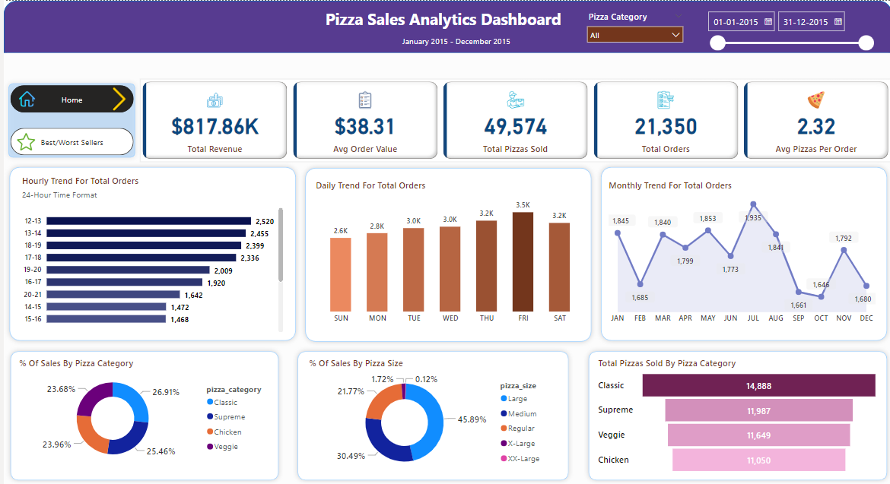
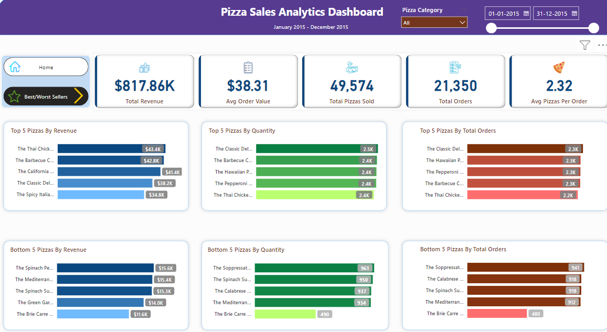

# Pizza Sales Analytics: Optimizing Performance and Customer Satisfaction for PizzaXpress
## Objective
* Our project offers the client flexibility in accessing insights based on their preference.

* For a detailed technical view of the approach used to create KPIs and trends, the SQL report provides a comprehensive analysis.

* Additionally, for a quick glance at the final numbers of the KPIs, SQL offers a straightforward presentation.

* For those interested in a more interactive and visually appealing experience with the ability to filter and drill down into specific data points using slicers and other tools, the Power BI dashboard is available.

* This dual approach ensures that the client can choose the format that best suits their analytical needs.

* Analyze sales data to identify trends and patterns in customer behavior.

* Gain insights into customer preferences for pizza categories and sizes.

* Determine the average number of pizzas per order and average order value.

* Identify top-selling and underperforming pizzas by revenue, quantity, and orders.

* Develop a comprehensive dashboard to visualize key performance indicators (KPIs) and trends.

## Background
* In the fiercely competitive food industry, understanding customer preferences and optimizing operational efficiency is crucial for success.
* Our client, PizzaXpress, sought to enhance its business intelligence capabilities to improve decision-making and drive growth.
* The goal of this project was to analyze sales data and customer behavior to uncover valuable insights that could be used to increase sales, improve customer satisfaction, and streamline operations.

